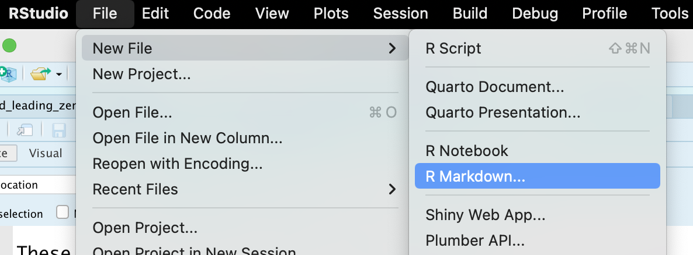
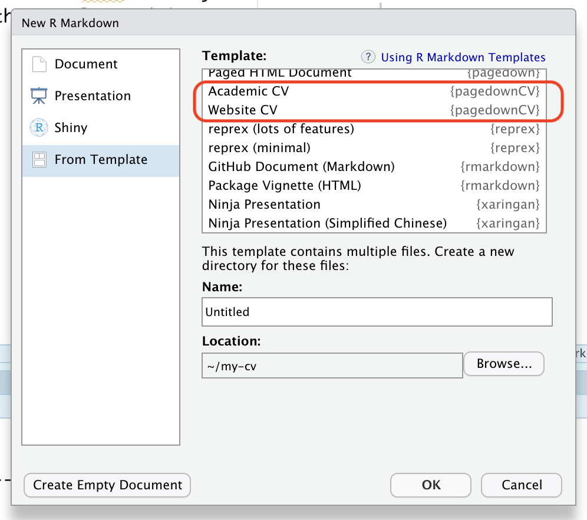
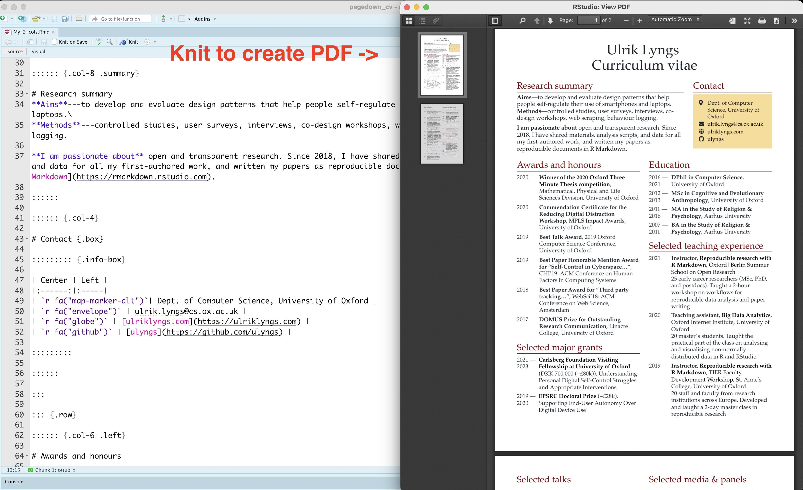

<!-- README.md is generated from README.Rmd. Please edit that file -->

# `pagedownCV`

<!-- badges: start -->
<!-- badges: end -->

This package provides three R Markdown templates for creating a
dynamically generated CV using `R markdown` and
[`pagedown`](https://github.com/rstudio/pagedown) for paged versions.

## Installation

``` r
#install.packages("remotes")
remotes::install_github("ulyngs/pagedownCV")
```

## Getting started

In RStudio, go to File \> New File \> R Markdown… \> From Template  
Then, choose either **Academic CV**, **2-column CV**, or **Website CV**.

Academic CV, and 2-column CV generates a PDF when you knit it (as well
as the source HTML) – the Website CV generates just an HTML file.

Like so:





## Formats included

### [Academic CV (paged)](https://github.com/ulyngs/personal-website/raw/master/static/images/for-r-packages/pagedownCV/README-one-column-academic.pdf)


<br>

### [2-column CV (paged)](man/figures/README-two-column.pdf)


<br>

### [Website CV (with sidebar and tabsets)](reference/figures/README-website-cv.html)


<br>

## Fiddling with page breaks

In both the Academic CV and the 2-column CV, you can write
`<br class="pageBreak" />` in your R Markdown source file, which will
add a page break at this location.

In the Academic CV, you might find that cell content that’s overflowing
to the next page gets placed in the wrong column on the subsequent page
(I’ve flagged it in [this
issue](https://github.com/rstudio/pagedown/issues/299) for `pagedown` —
hopefully there’s a solution soon). If you encounter this, you can work
around it by manually inserting a page break in the row before. There’s
a convenience function for this, that’s described
[here](https://ulyngs.github.io/pagedownCV/reference/manual_page_break_after_row.html).

## Motivation

The [`pagedown`](https://github.com/rstudio/pagedown) package lets you
output an R Markdown file to paged HTML content which can then be saved
as PDF. This means you can use R Markdown to programmatically pull out
content from some spreadsheet with our CV data, output it to a paged
format, do the styling with CSS, then save as PDF and/or host it online.
Brilliant!

Nick Strayer’s excellent [data-driven
cv](http://nickstrayer.me/datadrivencv/)) package, as well as the base
format for resumés provided by `pagedown` (`pagedown::html_resume`),
make this easy to do.

However, their available layouts don’tsuit my taste (especially for an
academic CV).

## Where do the layouts come from?

When I designed the Academic CV, I was particularly inspired by the
resumés of [Matthew Kay](http://www.mjskay.com/) and [Elena
Agapie](https://eagapie.com/pubs/cv.pdf). I use this format for academic
purposes.

The two-column one, I originally designed in Microsoft Word, with the
intention of using it for brief, professional 2-page resumés where you
need to squeeze content into less space.

## How does it work?

Each resumé is generated by an R Markdown file that pulls in content
from the included excel file **cv_data.xlsx**.

The sample content comes from [this google
sheet](https://docs.google.com/spreadsheets/d/1ta71CAGkcLqm-W1UdVRA_JJSddWV2TsrRZsCnQlmOis/edit?usp=sharing),
which holds my CV information along with most of the content for [my
website](https://ulriklyngs.com/).

Enjoy!!
