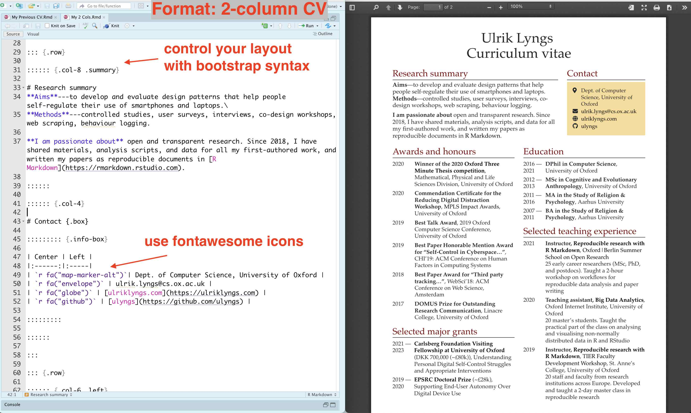
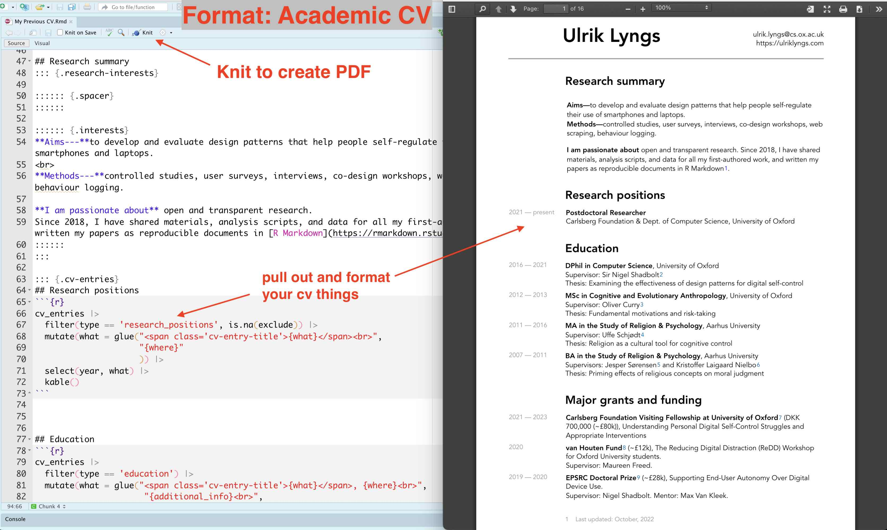
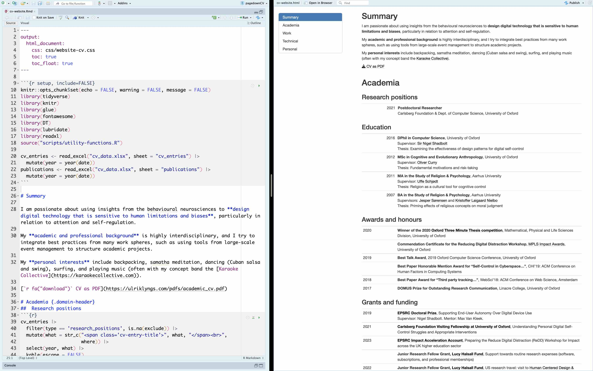

# `pagedownCV`

This repo provides three R Markdown templates for creating a
dynamically generated CV using `R Markdown`. The templates use the
[`pagedown`](https://github.com/rstudio/pagedown) library for the paged versions.

## How to use
First, download or clone this repo.

### Knitting
Open and knit one of the .Rmd files:

- [**cv-2-column.Rmd**](https://ulyngs.github.io/pagedownCV/examples/cv-2-column.pdf) (creates a PDF when knit) \
  
  
- [**cv-academic.Rmd**](https://ulyngs.github.io/pagedownCV/examples/cv-academic.pdf) (creates a PDF when knit; traditional one-column format, appropriate for a traditionally laid out academic CV) \
  

- [**cv-website.Rmd**](https://ulyngs.github.io/pagedownCV/examples/cv-website.html) (creates an HTML file when knit; example of a CV laid out as it might be used on a website) \
  

## Fiddling with page breaks

In both the Academic CV and the 2-column CV, you can write
`<br class="pageBreak" />` in your R Markdown source file to
add a page break at this location.

In the Academic CV, cell content that’s overflowing 
to the next page might get placed in the wrong column on the subsequent page
(I’ve flagged it in [this
issue](https://github.com/rstudio/pagedown/issues/299) for `pagedown` —
hopefully there’s a solution soon). If you encounter this, you can work
around it by manually inserting a page break in the row before. There’s
a convenience function for this:

```r
# Adds a page break after a row that contains a specified text in a specified column
a_data_frame |>
  manual_page_break_after_row("name-of-a-column", "Text in that column")
```

If you look through **cv-academic.Rmd** then you'll see examples of this throughout.

Similarly, you'll find convenience functions for replacing authors' first names with an initial followed by a dot, and for replacing a repeated year with an empty string.

The convenience functions live in **R/utility-functions.R**

## Motivation

The [`pagedown`](https://github.com/rstudio/pagedown) package lets you
output an R Markdown file to paged HTML content which can then be saved
as PDF. This means you can use R Markdown to programmatically pull out
content from some spreadsheet with our CV data, output it to a paged
format, do the styling with CSS, then save as PDF and/or host it online.
Brilliant!

Nick Strayer’s excellent [data-driven
cv](http://nickstrayer.me/datadrivencv/)) package, as well as the base
format for resumés provided by `pagedown` (`pagedown::html_resume`),
make this easy to do.

However, their available layouts don’tsuit my taste (especially for an
academic CV).

## Where do the layouts come from?

When I designed the Academic CV, I was particularly inspired by the
resumés of [Matthew Kay](http://www.mjskay.com/) and [Elena
Agapie](https://eagapie.com/pubs/cv.pdf). I use this format for academic
purposes.

The two-column one, I originally designed in Microsoft Word, with the
intention of using it for brief, professional 2-page resumés where you
need to squeeze content into less space.

## How does it work?

Each resumé is generated by an R Markdown file that pulls in content
from the included excel file **cv_data.xlsx**.

The sample content comes from [this google
sheet](https://docs.google.com/spreadsheets/d/1ta71CAGkcLqm-W1UdVRA_JJSddWV2TsrRZsCnQlmOis/edit?usp=sharing),
which holds my CV information along with most of the content for [my
website](https://ulriklyngs.com/).

Enjoy!!
