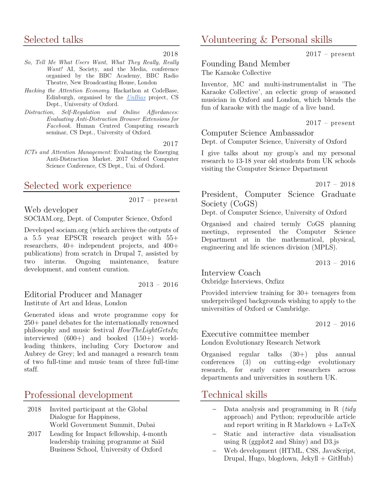

This repository has three different versions of my resume, with the paged versions created with [`pagedown`](https://github.com/rstudio/pagedown) (NOTE: for now 1 and 2 only works properly in Chrome, as some aspects of CSS Paged Media are only supported by this browser):

1. [Short, 2-page professional resume](professional_cv.html)
2. [Paged full resume](one-column-paged.html)
3. [Ordinary scrolling HTML resume](one-column.html)

The resumés pull in different subsets of cv entries that live in two separate Excel files on my machine (one for publications, one for all other cv entries).

Here is the original resume layout (made in Microsoft Word) that I wanted to recreate with `pagedown`:
{ width=49% } { width=49% }

